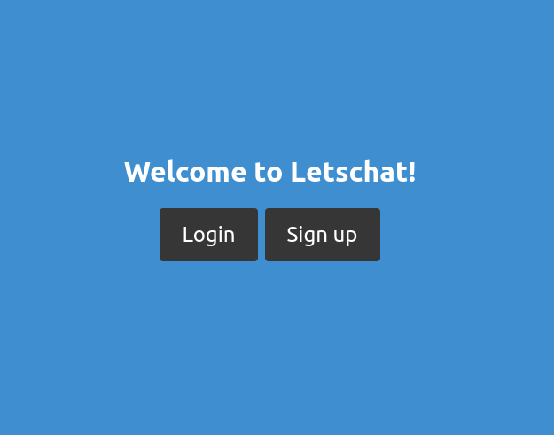
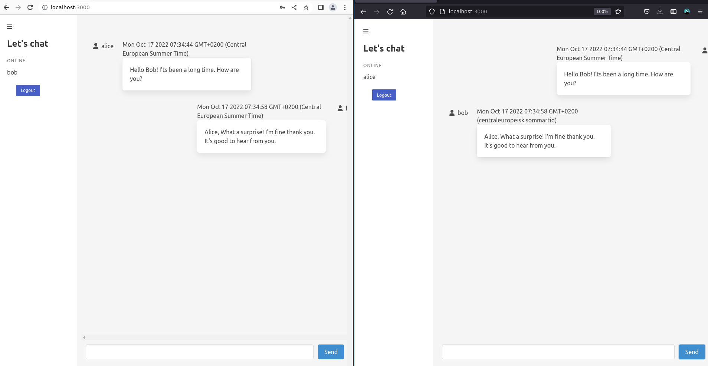
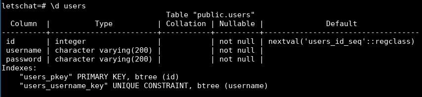
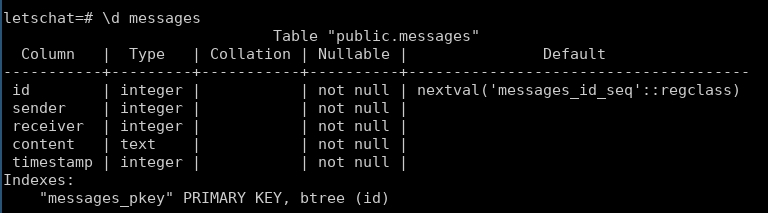

This is a chatapplication. It's using websockets and data is encrypted at rest using pntscrypt.

# Demo

Landing page  
  
Chat view  

# Installation

## Database

Letschat is currently supporting Postgres as backend database.

### Postgres binary

You need to install postgress in order to use Letschat. Here's an example how to install it using docker:

`docker run --name letschat -e POSTGRES_PASSWORD=019bf39f5ba6bc62505e983a2bc006fe -p 5432:5432 -d postgres`

Letschat expects Postgres to be listening on port 5432.

### Environmental variables

We expect 3 environmental variables to be set for database connection to work:
| env variable | description |
|--|--|
| DATABASE_URL | Url to database, e.g. 127.0.0.1 |
| DATABASE_NAME | the name of the database, e.g. letschat |
| DATABASE_PASSWORD | password for authentication, e.g. 019bf39f5ba6bc62505e983a2bc006fe |

### Postgres tables

You need to create 2 tables for Letschat to work:
| table name | description |
|------------|--------------------------|
| users | for storing user objects |
| messages | for storing messages |

Users table  
  
Messages table  

They can be created like so:  
`CREATE TABLE users(id serial primary key, username varchar(200) unique not null, password varchar(200) not null);`  
`CREATE TABLE messages(id serial primary key, sender integer not null, receiver integer not null, content text not null, timestamp integer not null);`

## Install Letschat

### Clone repo and install dependencies

Clone git repo: `git clone https://github.com/pontus-lnu/letschat.git`  
Install dependencies: `npm run install`

### Environmental variables

We expect 1 environmental variable to be set in order for Letschat to work:
| env variable | description |
|--|--|
| SESSION_MIDDLEWARE_SECRET | Secret used by session middleware, e.g. 1baf1a30dfcc0e6789aeeec5f8aa5ea1 |

### Start Letschat

Start Letschat: `npm run start`  
The application listens on port 3000 by default.
